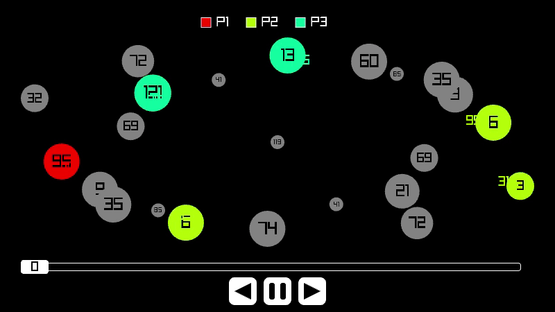

# Planet Wars C Engine & Visualizer

A lightweight, high-performance, cross-platform engine and visualizer written in C for Planet Wars, according to the **Google Planet Wars 2010 AI Challenge** specification with some new additions.

This project simulates multi-bot space strategy battles in real time, executing bot binaries as asynchronous child processes over standard IPC, tracking the simulation log, and rendering the battle using [raylib](https://www.raylib.com/).



## Getting Started

You can download a release from the [releases page](https://github.com/yuval-herman/Planet-Wars-Runner/releases/latest). Alternatively, you can build the project from source using the instructions at the end of this page. Building this project is incredibly easy and does not require and additional downloads other then a standard c compiler.

## Running the Simulation

Upon a successful build, the compiled executable `planet_wars` will be generated in the root directory.

Run the binary to launch the engine and visualizer:

```bash
./planet_wars -help
```

#### Keyboard controls

- **right/left** - jump one turn forewards/backwards
- **up/down**    - increase/decrease replay speed
- **space**      - pause/unpause replay

## Save files

After running a simulation between two bots, if you passed the `-write_save` flag, a `game.plws` file will be saved to disk. This file contains the entire simulation, and can be viewed again by passing the `-load_from` flag with the file path. This files are in a binary format and only viewable via the planet_wars software.

After running a tournament, `match_(number).plws` files will be saved for each match in the tournamnet.

## Configuration file

You can specify a config file by using the `-config` flag and providing a path to a `.ini` file.
> [!NOTE]
> Configs specified in the config file override configs passed via CLI flags. For example if you pass the `-map` flag and also specify a `map` key in the `simulation` section of the config file, the map from the config file will be used.


> [!IMPORTANT]
> While the information above holds true for all keys used in the `application` and `simulation` sections, if you specify bots to be used in the configs file and also pass bots via CLI flags, the list will be merged and all specified bots will be used together.

This is an example config file with comments explaining everything:

```ini
[application]
write_save = true            ; Whether to write a game.plws file containing a save of the game. You can replay this files using the -load_from CLI argument.
save_file = game.plws        ; A file path for the save file.
tournament = true            ; Whether to run a tournament between all supplied bots.
                             ; this requires more bots specified then the map requires.

[simulation]
map = map.txt                ; Path to the map file that will be used.

[bot]
name = Okay Bot              ; Name for the bot. Optional, but good for tournament mode.
command = python okay_bot.py ; Actuall command that will be invoked by the manager.

; Each bot can be defined in it's own section
[bot]
name = Worst bot
command = node worst_bot.js

[bot]
name = Best bot
command = ./best_bot
```

## Building the Project

### Prerequisites

* A standard C compiler (`gcc` or `clang`)
* Raylib dependencies. Make sure to read raylibs compilation page before this.
  If you don't want to compile raylib from scratch, you can also download a raylib release from [here](https://github.com/raysan5/raylib/releases) and place the `libraylib.a`(Linux) or `libraylib.lib`(windows) file inside the `build` folder.

### Building

The project uses `nob.c` to compile dependencies, including Raylib, alongside the main target automatically.

1. Bootstrap the build system and compile the project:
```shell
gcc -o nob nob.c
./nob
```

2. Subsequent builds:
The build script supports auto-rebuilding via `NOB_GO_REBUILD_URSELF`. Execute `./nob` whenever modifications are made to `nob.c` or project source files.

The compiled nob file has some flags to change functionallity, you can inspect them by passinh `-help`.

### Building for the web

Building for the web relies on [emscripten](https://emscripten.org/).
If you installed and activated emscripten, you can follow the normal building steps to compile nob and just add `-wasm` when compiling the program.

### Running tests

We use cmocka for testing. You can compile the program and use it without the tests, but you need to install cmocka if you want to contribute to this project. You can find instructions on how to install cmocka [on the cmocka repository](https://gitlab.com/cmocka/cmocka).

After installing cmocka and compiling nob, you can run tests by running this command:

```shell
./nob -test -debug -force
```

## License

Distributed under the GNU AFFERO License. See the `LICENSE` file for more information.
